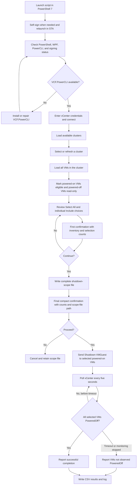

# vCenter Cluster Graceful Shutdown

A Windows PowerShell 7 WPF utility for reviewing the complete VM inventory of a single vCenter cluster, excluding protected workloads, issuing VMware Tools guest operating system shutdown requests, and monitoring selected VMs until they report `PoweredOff`.

**Current release:** 1.0
**Script:** `vCenter-Cluster-Graceful-Shutdown-v1.6.ps1`  
**Platform:** Windows with PowerShell 7 and WPF  
**PowerCLI:** `VCF.PowerCLI`, with support for the underlying `VMware.VimAutomation.Core` module

> [!CAUTION]
> This utility can shut down every selected powered-on VM in a cluster. Test in a nonproduction environment, use an account with only the required vCenter permissions, review all exclusions, and verify the generated scope file before accepting the final confirmation.

## Overview

The utility connects to one vCenter Server, retrieves its clusters, and displays every VM in the selected cluster. Powered-on VMs are eligible for graceful shutdown and are selected by default. VMs already powered off remain visible for inventory awareness but cannot be selected.

Before any shutdown request is sent, the operator can:

- Review the complete cluster inventory.
- Use **Select All** to select or clear all eligible powered-on VMs.
- Deselect individual VMs that must remain running.
- Review live Inventory, Currently On, Already Off, Selected, and Excluded counters.
- Complete two separate confirmation steps.
- Review a timestamped scope file containing the complete selected and excluded VM lists.

The utility uses `Shutdown-VMGuest`. It does not use `Stop-VM` and does not include a hard power-off fallback.

## Key Features

- Single-vCenter connection using a username and password
- Cluster discovery and selection
- Complete cluster VM inventory, including powered-off VMs
- Powered-on eligibility enforcement
- Three-state **Select All** control
- Individual VM inclusion and exclusion
- Live inventory and shutdown counters
- VMware Tools status visibility
- First-level scope confirmation
- Compact final confirmation suitable for clusters with hundreds of VMs
- Complete timestamped shutdown-scope text file
- Graceful guest OS shutdown requests only
- Five-second vCenter status polling
- Configurable monitoring timeout
- Stop-monitoring control that does not hard-stop VMs
- Per-VM status updates
- Timestamped CSV results and text logs
- PowerShell, WPF, PowerCLI, and code-signing prerequisite display
- In-application `VCF.PowerCLI` install or repair action
- Automatic self-signing at launch when a valid signature is not already present
- Automatic STA relaunch for WPF compatibility

## Workflow



## Requirements

### Workstation

- Windows 10, Windows 11, or Windows Server with an interactive desktop session
- PowerShell 7 or later
- .NET/WPF support
- Network access to the target vCenter Server
- Access to PowerShell Gallery when using the built-in PowerCLI installation option
- Write access to the script's current working directory for run folders, logs, scope files, and CSV reports

### PowerCLI

The preferred module is:

```powershell
Install-Module -Name VCF.PowerCLI -Scope CurrentUser
```

The UI also provides **Install / Repair VCF PowerCLI**, which installs the NuGet provider when required, ensures PowerShell Gallery is registered, installs `VCF.PowerCLI` for the current user, imports the module, and reruns prerequisite checks.

### vCenter Permissions

The connecting account requires permission to:

- Read vCenter inventory
- Read clusters and virtual machines
- Read VM power and VMware Tools status
- Invoke guest operating system shutdown on the selected VMs

Use a dedicated least-privilege automation role where possible.

### Guest Requirements

Graceful shutdown requires:

- VMware Tools or open-vm-tools installed in the guest
- Tools running and responsive
- A guest operating system capable of responding to the shutdown request

A VM without responsive Tools might remain powered on. The utility reports the condition and does not escalate to a hard power-off.

## Installation

1. Download `vCenter-Cluster-Graceful-Shutdown-v1.6.ps1`.
2. Place the script in an approved writable automation folder.
3. Open PowerShell 7 in an interactive Windows session.
4. Run the script:

```powershell
pwsh.exe -NoProfile -ExecutionPolicy Bypass -File ".\vCenter-Cluster-Graceful-Shutdown-v1.6.ps1"
```

The script automatically relaunches in STA mode when needed.

## Quick Start

1. Review the prerequisite indicators.
2. If PowerCLI is missing, select **Install / Repair VCF PowerCLI**.
3. Enter the vCenter FQDN or IP address, username, and password.
4. Decide whether the session should ignore an untrusted vCenter certificate.
5. Select **Connect**.
6. Select the required cluster.
7. Review all VMs in **VM Status**.
8. Clear **Include** for every powered-on VM that must remain running.
9. Verify the Selected and Excluded counters.
10. Select **Gracefully Shut Down Selected VMs**.
11. Review and accept the first confirmation.
12. Review the final counts and scope-file path.
13. Open the scope file if additional review is required.
14. Accept the final confirmation only when the scope is correct.
15. Monitor the Remaining count and per-VM status.
16. Review the final CSV report and log.

## Selection Behavior

- Every powered-on VM is initially selected.
- Every powered-off VM is visible but not eligible.
- Checking **Select All** selects all eligible powered-on VMs.
- Clearing **Select All** clears all eligible powered-on VMs.
- Individual powered-on VMs can be selected or excluded afterward.
- A mixed selection causes **Select All** to display its indeterminate state.
- At least one eligible powered-on VM must be selected before execution.

## Confirmation Model

### First Confirmation

The first confirmation displays:

- Cluster name
- Total cluster inventory
- Currently powered-on count
- Selected shutdown count
- Excluded powered-on count

### Final Confirmation

The final confirmation intentionally does not list VM names. It displays:

- Cluster name
- Total cluster inventory
- Currently powered-on count
- Selected shutdown count
- Excluded count
- Already-powered-off count
- Complete scope-file path
- Reminder that no hard power-off fallback is used

The complete selected and excluded VM names are stored in the scope file instead of being placed in the popup. This keeps the final dialog usable for clusters containing hundreds of VMs.

## Outputs

Each launch creates a directory similar to:

```text
ClusterShutdown-Run-YYYYMMDD-HHMMSS
```

Typical contents include:

```text
ClusterShutdown-YYYYMMDD-HHMMSS.log
ShutdownScope-ClusterName-YYYYMMDD-HHMMSS.txt
ClusterShutdownResults-YYYYMMDD-HHMMSS.csv
```

### Scope File

The scope file records:

- Generation timestamp
- vCenter name
- Cluster name
- Total cluster inventory
- Currently powered-on count
- Already-powered-off count
- Selected shutdown count
- Excluded count
- Complete selected VM list
- Complete excluded VM list

The scope file is retained even when the operator declines the final confirmation.

### Results CSV

The results CSV includes:

- Include state
- VM name
- Final observed power state
- VMware Tools status
- Shutdown request status
- Completion timestamp
- Result message

## Safety Controls

- No hard power-off fallback
- Powered-off VMs cannot be selected
- Explicit per-VM inclusion controls
- Select All supports individual exceptions
- First confirmation verifies counts
- Final confirmation verifies counts and scope-file location
- Complete scope file is written before the final confirmation
- Timeout does not trigger `Stop-VM`
- Stop Monitoring does not power off or interrupt VMs
- VMs not observed as powered off are clearly reported
- vCenter connection mode is set to single-server operation

## Certificate Handling

The **Ignore untrusted vCenter certificate** option applies only to the current PowerCLI session. For production use, install and trust the correct vCenter certificate rather than relying on certificate bypass.

At launch, the script attempts to use an existing Current User code-signing certificate. If none is available, it can create a local self-signed code-signing certificate and sign the script. A self-signed signature does not automatically establish trust on other computers.

## Troubleshooting

### VCF.PowerCLI is not installed

Select **Install / Repair VCF PowerCLI** or run:

```powershell
Install-Module -Name VCF.PowerCLI -Scope CurrentUser -Force -AllowClobber
```

### Connection failed

Verify:

- vCenter FQDN or IP address
- Username format
- Password
- DNS resolution
- TCP 443 connectivity
- Certificate trust or the session certificate option
- Account permissions

### A VM remains powered on

Review its Tools Status and message. Confirm VMware Tools or open-vm-tools is installed and running. The utility does not perform a hard power-off.

### Powered-off VMs are missing

Select **Refresh Clusters** or reselect the cluster. Version 1.5 and later load all cluster VMs, including those already powered off.

### Select All appears filled rather than checked

The filled state means the list contains a mixture of selected and excluded powered-on VMs. This is expected.

### The popup does not show VM names

This is intentional in version 1.6. Review the complete selected and excluded VM lists in the displayed `ShutdownScope` file.

### Monitoring was stopped

Stopping monitoring does not cancel guest shutdown requests already sent. Refresh vCenter inventory or reopen the utility to inspect current power states.

## Security and Change Control

- Use an approved change record for production shutdowns.
- Restrict access to the script and output directory.
- Protect logs and reports because they contain infrastructure names and local paths.
- Do not store credentials in the script.
- Use least-privilege vCenter permissions.
- Review the scope file before final approval.
- Test upgrades in a nonproduction vCenter environment.
- Retain the prior script revision for rollback.
- Archive the script, scope file, results CSV, and log as change evidence when required.

## Release Notes

### 1.6.0

- Removed VM-name previews from the final confirmation.
- Retained only inventory counts and the complete scope-file path.
- Preserved full selected and excluded lists in the scope file.

### 1.5.0

- Added all cluster VMs to the preview, including powered-off VMs.
- Added Inventory, Currently On, and Already Off counters.
- Disabled selection for powered-off VMs.
- Restricted Select All and shutdown actions to eligible powered-on VMs.

### 1.4.0

- Added three-state Select All behavior.
- Preserved individual VM exceptions after bulk selection.

### 1.3.0

- Added timestamped shutdown-scope files.
- Limited confirmation content for large clusters.

### 1.2.0

- Added per-VM Include controls.
- Added Selected and Excluded counters.
- Added two-level confirmation.

### 1.1.0

- Added `VCF.PowerCLI` detection and install or repair support.
- Moved the output log to the bottom of the UI.
- Moved self-signing to launch.

### 1.0.0

- Initial single-vCenter cluster graceful shutdown release.

## License

Add the repository's approved license before public distribution.

## Disclaimer

Use at your own risk. Validate the script and permissions in a controlled environment before production use. The repository owner and contributors are not responsible for downtime, data loss, or operational impact caused by incorrect selection, insufficient guest readiness, or unauthorized use.

